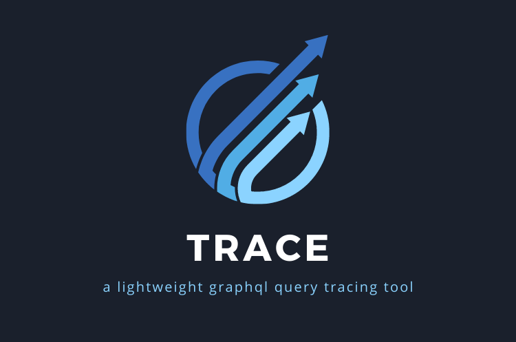
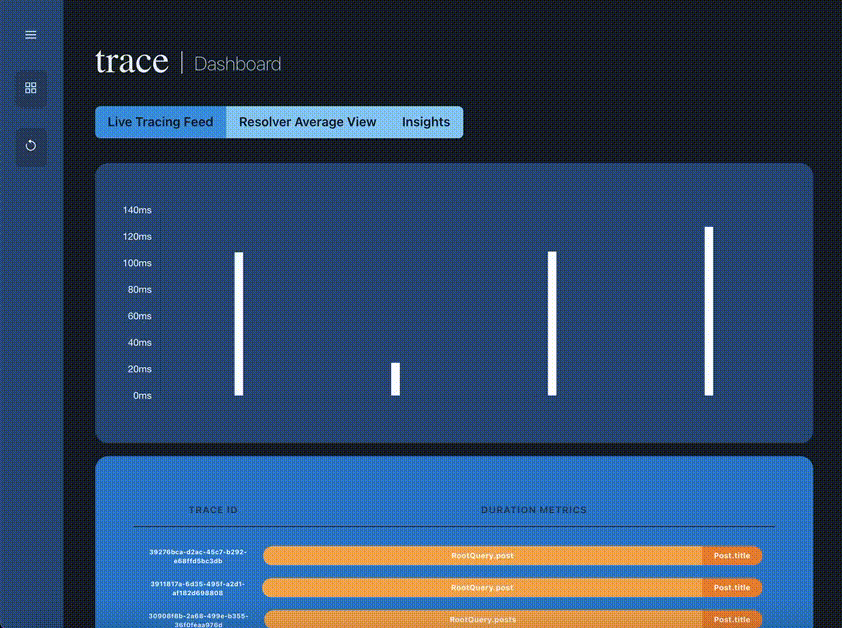
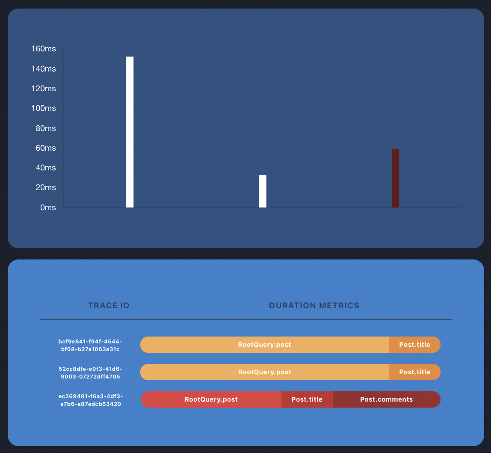
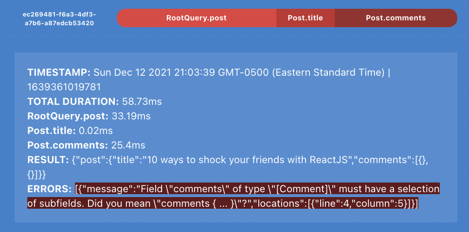
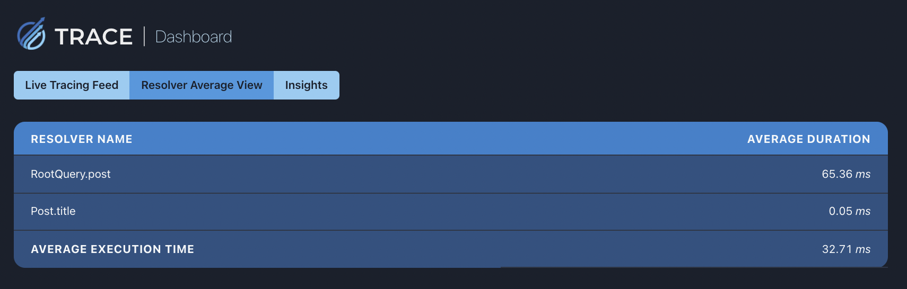
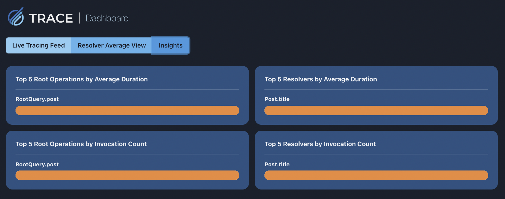
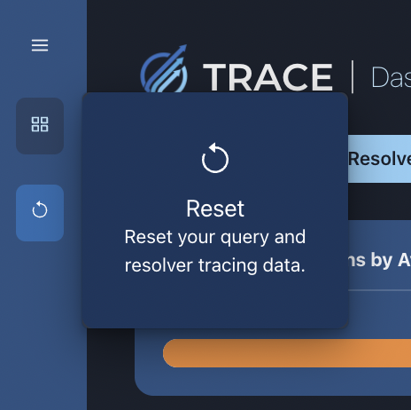

## Trace ✏️

Trace is a lightweight, open-source GraphQL query performance testing GUI that provides users with real-time, resolver-level performance tracing metrics. At its inception, Trace was created for the developer looking for a straightforward option for query performance monitoring on their Express-GraphQL server -- without having to install hefty libraries full of tools they'll never use such as Apollo or Hasura. Trace provides a simple, intuitive interface for users looking to test queries for their Express-GraphQL servers.

As a easy-to-configure and self-contained application, Trace not only equips users with resolver-level query tracing but also illustrative insights on specific resolvers. Trace is designed to be used in a development environment for debugging and performance tuning. 

## Table of Contents 📋

- Features
- Installation
- Configuration
- Trace GUI
- Usage & Examples
- Contributing
- License
- Authors


## Features ✨

- Real-time, resolver-level query performance data collection from your GraphQL server
- Visualization of individual query traces and averages
- Insights on the averages and counts of root operations and specific resolvers
- Error tracking for queries that fail during the GraphQL parsing, validation, or execution phase


## Installation ⚙️

    $ npm i --save-dev @go-trace/tracer


## Configuration 🔧

Trace works with one of the simplest ways to run a GraphQL API server: Express, a popular web app framework for Node.js. 

1. After installing the package, require the package in your Express app:

    const goTrace = require('@go-trace/tracer');

2. Create a GraphQLSchema instance. You can use the same schema as you would in your Express app. If you're using the GraphQL Tools library, you can use 'makeExecutableSchema' to generate a GraphQLSchema instance from GraphQL schema language (see Usage & Examples for sample code).

      ```  
      const schema = new GraphQLSchema({
        query: new GraphQLObjectType({
          name: 'RootQuery',
          fields: {
            post: {
              type: postType,
              args: {
                id: {
                  type: new GraphQLNonNull(GraphQLInt)
                }
              },
              resolve: async (obj, args) => {
                return pool.query(`SELECT * FROM "posts" WHERE id = $1`, [args.id])
                  .then((result) => result.rows[0])
              }
            },
            posts: {
              type: new GraphQLList(postType),
              resolve: async () => {
                return pool.query(`
                  SELECT * FROM "posts"
                `, []).then((result) => result.rows);
              }
            },
          },
        }),
      });
      ```

3. Setup your GraphQL server with Trace.

    ```
    app.use('/graphql', async (req, res) => {
      const query = req.body.query
      const variables = req.body.variables
      const response = await goTrace(
        schema,
        query,
        null, // Optional: rootValue, which will get passed as the root value to the executor
        null, // Important: leave this nulL!
        variables
      )
    });
    ```
4. And that's it! Trace will now collect query performance data for your GraphQL server. The GUI will automatically run at http://localhost:2929/ once your first query runs.


## Trace GUI 🧮

When you visit http://localhost:2929/ in your browser, you'll see a simple, intuitive interface that first reveals a live graph of traces. By clicking on a trace, represented by a bar on the graph, you will be navigated to a detailed view of the trace. Detailed view of each trace can be found below the graph. This includes the trace ID, timestamp, total duration, resolver-specific duration, the result and any error messages (more below on error tracing).



Trace additionally provides illustration of real-time error logging. Queries that fail during the GraphQL parsing, validation, or execution phase will be marked in red. You can view the specific error messages by clicking on specific trace.




The dashboard has two additional views: Resolver Average View and Insights.




To reset the GUI, you can click on the "Reset" button located at the bottom of the sidebar. This will clear all traces and error messages.

